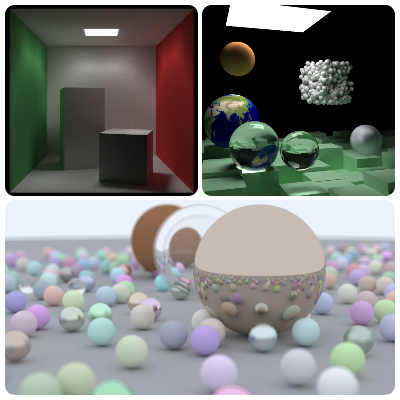
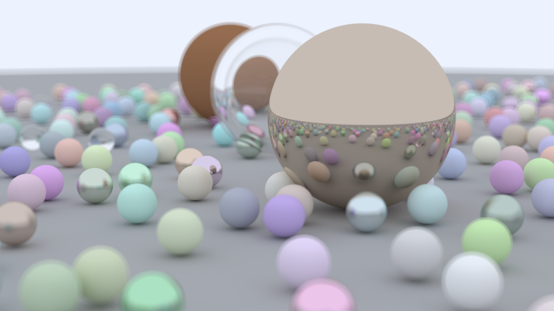
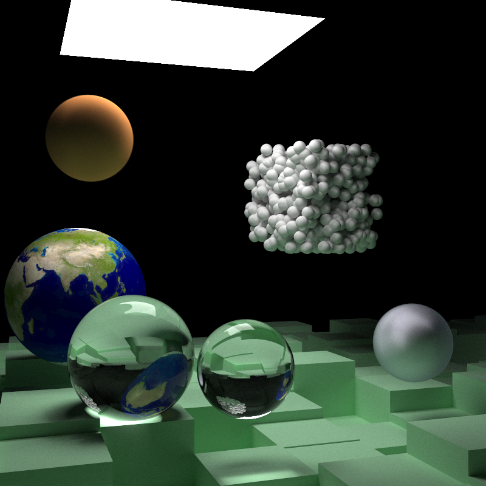
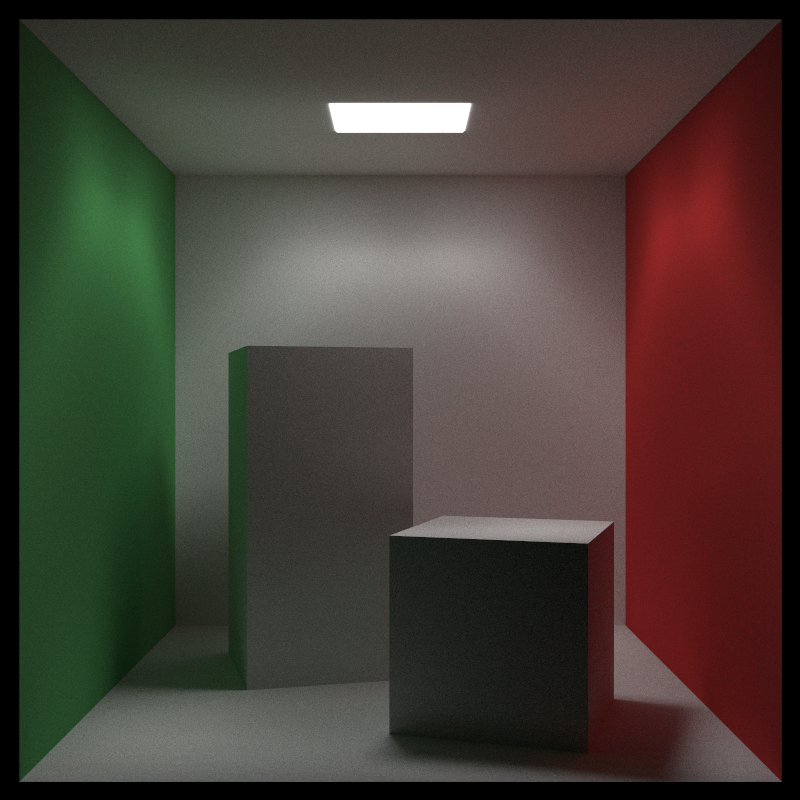

# 光线追踪

本项目是学习<a href="https://raytracing.github.io/books/RayTracingInOneWeekend.html">《Ray Tracing in One Weekend》</a>和<a href="https://raytracing.github.io/books/RayTracingTheNextWeek.html">《Ray Tracing: The Next Week》</a>光线追踪教程完成的作品。

CPU 分支中采用CPU多线程技术加速光线追踪，并且结合Qt框架实时显示渲染效果。
GPU 分支中采用NVIDIA 的 CUDA 技术，实现了 GPU 并行加速。

## 功能：

该项目实现了以下功能：

- 递归式光线追踪
- 球体、立方体
- 灯光
- 朗伯材质、金属材质、介质材质
- 抗锯齿
- 动态模糊
- 散焦模糊
- 纹理映射
- BVH加速
- CPU/GPU并行

相关笔记：

<a href="https://github.com/JiaboLi-GitHub/Note/blob/main/%E5%85%89%E7%BA%BF%E8%BF%BD%E8%B8%AA/%E5%85%89%E7%BA%BF%E8%BF%BD%E8%B8%AA.md">光线追踪笔记</a>

<a href="https://github.com/JiaboLi-GitHub/Note/blob/main/CUDA/CUDA.md">CUDA笔记</a>

## 展示

场景-in One Weekend

场景-The Next Week

场景-康奈尔盒

## 数据

展示区域的图片是以每个像素一万条光线，每条光线最多递归五十次进行光线追踪，使用腾讯云服务器AMD EPYC 7K83 64-Core Processor   2.54 GHz 64核执行，渲染耗时如下表所示：

|     场景     | in One Weekend | The Next Week | 康奈尔盒 |
| :----------: | :------------: | :-----------: | :------: |
| 耗时（分钟） |     10.88      |     31.53     |  64.99   |